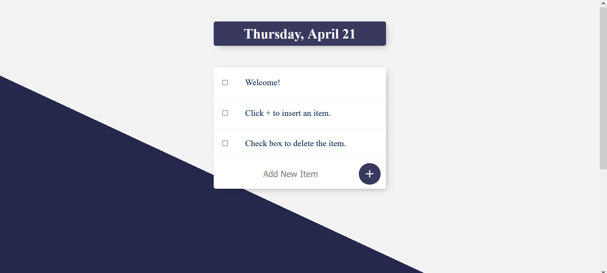

# To-Do-List

- A web-based platform tailored for creating and managing To Do Lists.
- Users can perform CRUD operations, such as adding items via the ”Add Item” button and deleting items through
checkboxes.
- Tech-Stack Used: **NodeJs, ExpressJs, MongoDB, JavaScript, HTML, CSS, and EJS**
- The application has been deployed utilizing the Render cloud platform

[Go to website](https://todolist01-berx.onrender.com/).

